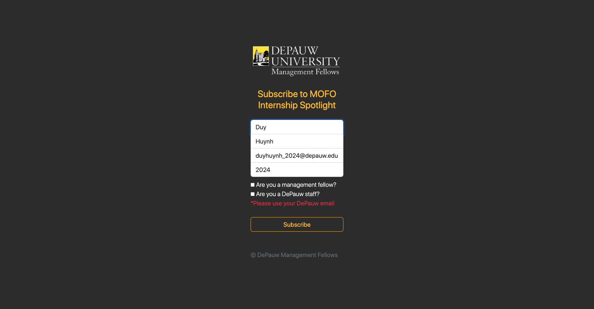
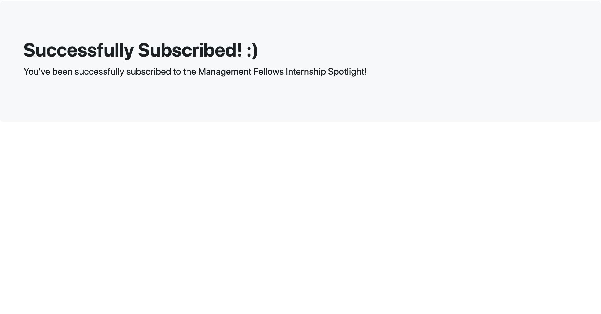
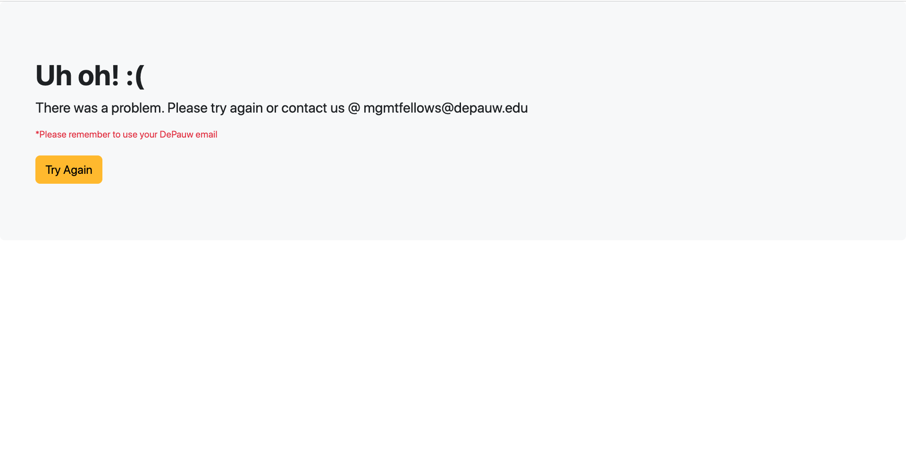

# Management Fellows Subscriber 📧


A website for DePauw Management Fellows students to subscribe to Internship Spotlight Newsletters on Mailchimp. Deployed on [Adaptable.io](https://adaptable.io/)

This website is used exclusively for Management Fellows students @ DePauw University, so it is not published. I've attached some photos below to show what the website looks like.

## Tech Stack

A Node.js and Express.js application using [Mailchimp API](https://mailchimp.com/developer/) and [templates from Bootstrap 5](https://getbootstrap.com/docs/5.2/examples/)

## Installation

- Clone this repo to make your Mailchimp Subscription.

```
git clone https://github.com/joshhn/mofo-email-subscriber.git
```

- Follow the [Mailchimp docs](https://mailchimp.com/developer/marketing/guides/quick-start/#generate-your-api-key) to get API_KEY and Audience ID
- Create a .env file (check .env.example file) to add API_KEY and URL
- Run local host or deploy on [Adaptable.io](https://adaptable.io/)
- Star this repo ⭐

## Usage






## Contributing

Pull requests are welcome. For major changes, please open an issue first
to discuss what you would like to change.

## License

[MIT](https://github.com/joshhn/mofo-email-subscriber/blob/main/LICENSE)
